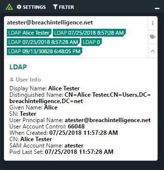

# Polarity LDAP Integration


> Important: We recommend testing this integration against a dev instance of your LDAP setup prior to connecting to a production LDAP system.  This is to ensure the queries do not overload your production LDAP server.

> The LDAP integration is a successor to the previous ActiveDirectory integration which has been deprecated.  New users should install the LDAP integration as it is more configurable and significantly more performant when querying your LDAP server due to the use of connection pooling.

The Polarity LDAP integration allows Polarity to search LDAP for user information.  

|  |
|---|
|*LDAP Example*|

## Connection Pooling

This integration makes use of connection pooling. This means the integration will maintain a pool of bound connections with your LDAP server.  When a new lookup request is received, one of the pooled connections will be used and then returned to the connection pool.  

## LDAP Integration Options

### LDAP Server URL

*Admin Only Setting* | *Changes Require Integration Restart*

URL for your LDAP server. This setting must be configured as an **admin-only setting** (i.e., each user cannot set their own value).  In addition, if you modify this value, you will need to restart the integration to ensure the connection pool is recreated.

For example:

```
ldap://dc.domain.com
```
or
```
ldaps://dc.domain.com
```

### Bind Distinguished Name

*Admin Only Setting* | *Changes Require Integration Restart*

The distinguished name that the integration will attempt to bind (authenticate) as. This setting must be configured as an **admin-only setting** (i.e., each user cannot set their own value). In addition, if you modify this value, you will need to restart the integration to ensure the connection pool is recreated.

For example:

```
uid=tony.stark,ou=Users,o=5be4c382c583e54de6a3ff52,dc=jumpcloud,dc=com
```

### Password

*Admin Only Setting* | *Changes Require Integration Restart*

The LDAP Account Password for the provided `Bind Distinguished Name`. This setting must be configured as an **admin-only setting** (i.e., each user cannot set their own value). In addition, if you modify this value, you will need to restart the integration to ensure the connection pool is recreated.

### Maximum Connection Pool Size

*Admin Only Setting* | *Changes Require Integration Restart*

The maximum number of pooled LDAP connections that will be maintained by the integration. If all pooled connections are in use new lookup requests will be queued (if too many requests are queued the integration will drop the request and report an error).  This option defaults to 10 but should be increased for larger deployments.  In general, you should have at least 1 connection per active integration user. 

> If you encounter the error "max waitingClients count exceeded" you will need to increase the maximum connection pool size.  


### Search Distinguished Name

The distinguished name from where searches will start.  The integration will search the whole sub tree under the provided distinguished name.

```
ou=Users,o=5be4c382c583e54de6a3ff52,dc=jumpcloud,dc=com
```

### User Email Search Attribute

The search attribute for user objects (case sensitive).  This attribute should be an email address and will be compared against the email address being looked up.  Typical values are `userPrincipalName`, `disintguishedName`, `sAMAccountName`, and `mail`.

### Summary User Attributes

One or more user attributes you would like to display in the summary portion of the integration.  If the attribute you would like to display is not listed, you can add a custom attribute using the `Custom Summary User Attributes` option.

### Custom Summary User Attributes

Custom user attributes you would like to display in the summary portion of the integration.  Provide a comma delimited list. Attributes are case sensitive.  Attributes provided in this setting will be displayed along with attributes selected for the `Summary User Attributes`.

### Detailed User Attributes

One or more user attributes you would like to display in the details portion of the integration

### Custom Detailed User Attributes

Custom user attributes you would like to display in the details portion of the integration.  Provide a comma delimited list. Attributes are case sensitive.


## Installation Instructions

Installation instructions for integrations are provided on the [PolarityIO GitHub Page](https://polarityio.github.io/).

## Polarity

Polarity is a memory-augmentation platform that improves and accelerates analyst decision making.  For more information about the Polarity platform please see:

https://polarity.io/
